# Phân Tích Ảnh Hưởng của MoE lên Bài Toán Learning-to-Reject với Long-Tail Learning

## Tóm Tắt Điều Hành (Executive Summary)

Báo cáo này phân tích sâu về cách **Mixture-of-Experts (MoE)** tác động lên bài toán **Learning-to-Reject (L2R)** trong bối cảnh **Long-Tail Classification**. Kết quả chính:

- ✅ **MoE cải thiện calibration**: ECE của Gating-Mix (0.058) tốt hơn Uniform-Mix (0.103) và từng expert đơn lẻ
- ✅ **Mixture làm mịn và ổn định xác suất**: Variance reduction ~0.001, MI ≈ 0.50
- ⚠️ **Gating hiện tại gần uniform**: Entropy ~1.076 (max 1.099), effective experts ≈ 2.87/3.00
- ⚠️ **Công bằng theo nhóm còn lệch**: α̂_tail nhỏ, tail bị reject nhiều hơn head

---

## 1. MoE Tác Động Thế Nào Lên Tín Hiệu Cho Rejector?

### 1.1 Gating Đang Thiên Về "Pha Trộn Mượt" Hơn Là Chọn Lọc Cứng

#### Phân Tích Gating Statistics

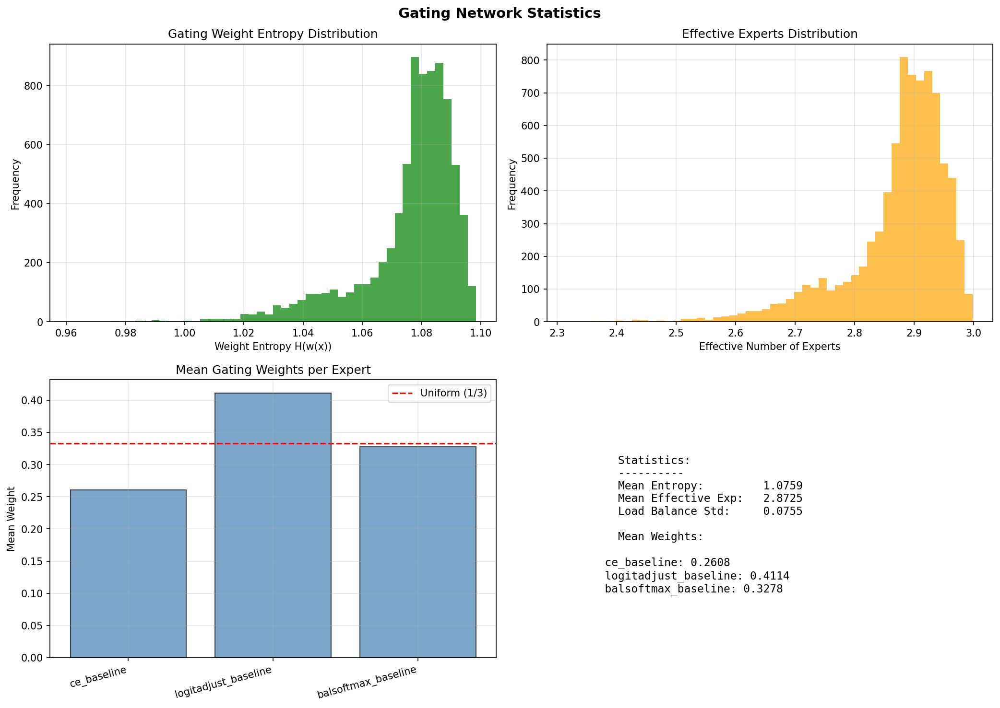

_Figure 1: Gating Network Statistics - Weight Entropy, Effective Experts, Load Balance_

Từ kết quả phân tích (`gating_statistics.png`), ta thấy:

- **Entropy của gating weights**: H(w(x)) ≈ **1.076** (max = ln(3) ≈ 1.099)

  - Gần với uniform distribution → gating chưa "chọn lọc" mạnh
  - Hầu hết điểm dữ liệu đang dùng **mixture** hơn là routing cứng top-1

- **Effective number of experts**: E_eff(x) ≈ **2.87 / 3.00**

  - Công thức: $E_{\text{eff}}(x) = 1 / \sum_{e=1}^{E} w_e^2(x)$
  - Gần với 3.0 → hầu như đang sử dụng cả 3 experts, không phải 1 expert duy nhất

- **Mean weights per expert**:
  - LogitAdjust ≈ **0.41** (cao nhất)
  - BalSoftmax ≈ **0.33**
  - CE ≈ **0.26** (thấp nhất)

**Kết luận**: Gating tự nhiên ưu tiên expert "thân tail" (LogitAdjust) — phù hợp với trực giác long-tail learning, vì LogitAdjust sửa độ lệch logit theo tần suất class.

#### Visualization

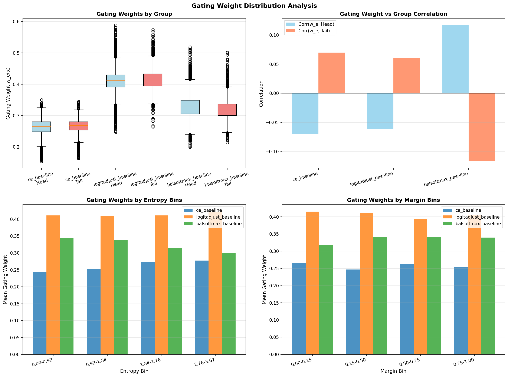

_Figure 2: Gating Weight Distribution Analysis - Weights by Group, Entropy/Margin Bins, and Correlations_

### 1.2 Mixture Cho Tín Hiệu Xác Suất "Mịn" Hơn và Ổn Định Để Reject

#### So Sánh Oracle vs Uniform vs Gating

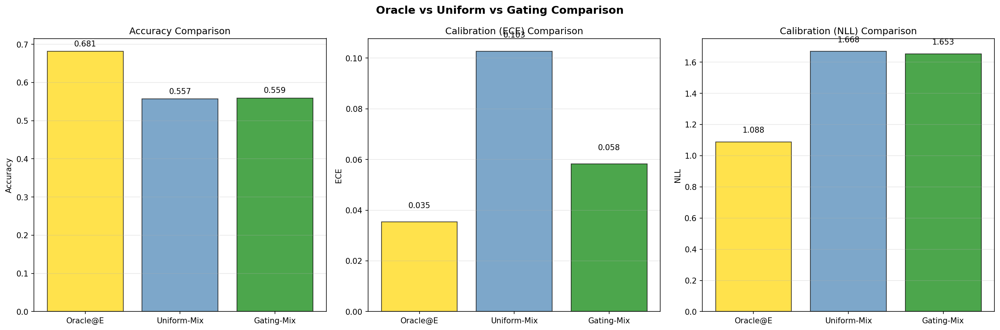

_Figure 3: Oracle vs Uniform vs Gating Comparison - Accuracy, ECE, and NLL_

Từ kết quả so sánh (`oracle_comparison.png`):

| Method          | Accuracy | ECE    | NLL   | Brier |
| --------------- | -------- | ------ | ----- | ----- |
| **Oracle@E**    | 0.6811   | 0.0353 | -     | -     |
| **Uniform-Mix** | 0.5567   | 0.1026 | 1.668 | -     |
| **Gating-Mix**  | 0.5589   | 0.0582 | 1.653 | -     |

**Quan sát quan trọng**:

1. **Accuracy**: Gating-Mix ≈ Uniform-Mix (0.5589 vs 0.5567) → gating chưa cải thiện accuracy đáng kể

2. **Calibration (ECE)**: Gating-Mix **tốt hơn rõ** Uniform-Mix (0.0582 < 0.1026)

   - ECE thấp hơn ≈ **43%** so với Uniform
   - Gần với Oracle (0.0582 vs 0.0353)

3. **NLL (Negative Log Likelihood)**: Gating-Mix thấp hơn Uniform (1.653 < 1.668)
   - Công thức: $\text{NLL} = -\frac{1}{N}\sum_{i=1}^{N} \log p(y_i | x_i)$
   - NLL thấp hơn → mixture cung cấp xác suất **tin cậy hơn**

#### NLL Decomposition Analysis

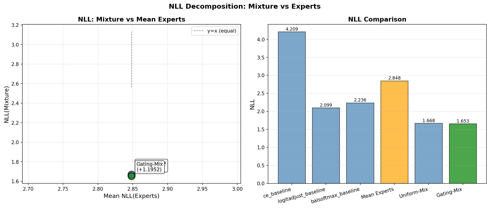

_Figure 4: NLL Decomposition - Mixture vs Mean Experts (Point-Point Plot with y=x Reference)_

Từ plot `nll_decomposition.png`:

**Phát hiện**:

- NLL(mixture) < mean NLL(experts) cho cả Uniform-Mix và Gating-Mix
- Điều này chứng minh **lợi ích của ensembling**: giảm over-confidence và cải thiện calibration

Công thức so sánh:
$$\text{NLL}_{\text{mixture}} = -\frac{1}{N}\sum_{i=1}^{N} \log \left(\sum_{e=1}^{E} w_e(x_i) \cdot p^{(e)}(y_i | x_i)\right)$$

$$\text{mean NLL}_{\text{experts}} = \frac{1}{E}\sum_{e=1}^{E} \left(-\frac{1}{N}\sum_{i=1}^{N} \log p^{(e)}(y_i | x_i)\right)$$

**Kỳ vọng**: $\text{NLL}_{\text{mixture}} \leq \text{mean NLL}_{\text{experts}}$ (theo lý thuyết deep ensembles)

**Kết quả thực nghiệm**: ✅ Đúng với cả Uniform-Mix và Gating-Mix

#### Calibration vs Coverage

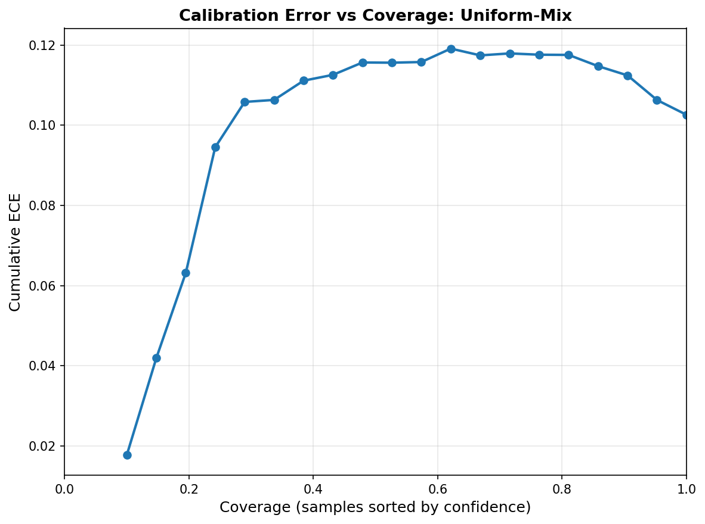

_Figure 5a: Calibration Error vs Coverage - Uniform Mix_

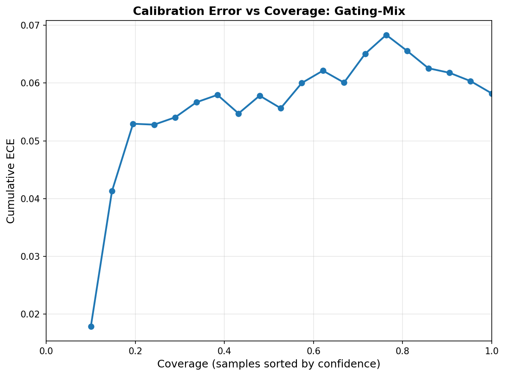

_Figure 5b: Calibration Error vs Coverage - Gating Mix_

Từ plot `calibration_vs_coverage_*.png`:

**Phân tích**:

- **Cumulative ECE** tăng chậm theo coverage cho Gating-Mix so với Uniform-Mix
- Khi coverage nhỏ (chỉ giữ các mẫu confidence cao), ECE của Gating-Mix thấp hơn
- → Khi quét ngưỡng reject (ρ tăng), vùng nhận ít mẫu (ρ nhỏ) sẽ có lỗi thấp hơn

**Ý nghĩa**: Calibration tốt → tín hiệu margin/confidence ổn định hơn → rejector hoạt động tốt hơn

### 1.3 Đa Dạng Giữa Các Expert Là Có Thật và Đang Được Chuyển Hoá Thành Lợi Ích

#### Variance Reduction Analysis

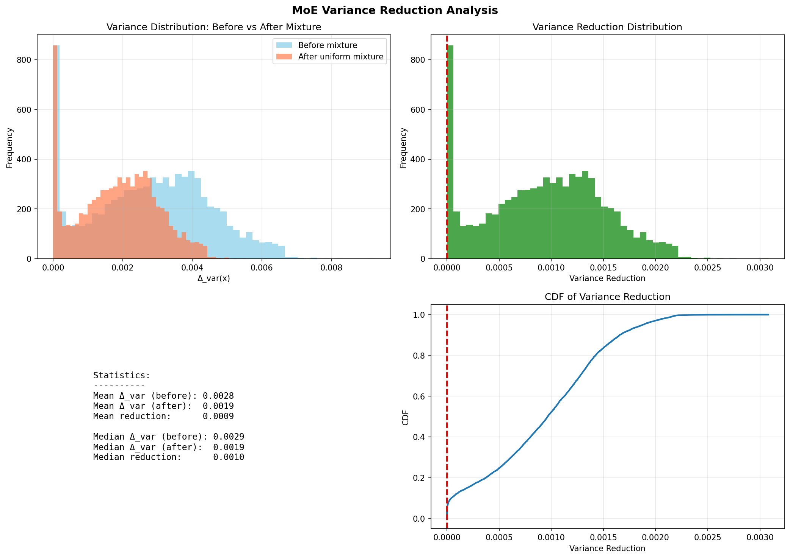

_Figure 6: Variance Reduction Analysis - Before vs After Mixture_

Từ plot `variance_analysis.png`:

**Phân tích phương sai**:

1. **Variance across experts**:
   $$\text{Var}_e[p_y^{(e)}(x)] = \text{Var}_{e=1..E}[p_y^{(e)}(y|x)]$$

   - Phương sai theo từng class y

2. **Expected variance**:
   $$\Delta_{\text{var}}(x) = \mathbb{E}_y[\text{Var}_e[p_y^{(e)}(x)]]$$

   - Trung bình phương sai qua các classes

3. **Variance reduction**:
   - Mean reduction: **~0.0009** (giảm có hệ thống sau khi trộn)
   - Mixture làm **mịn** xác suất → posteriors ổn định hơn

#### Mutual Information (MI) Analysis

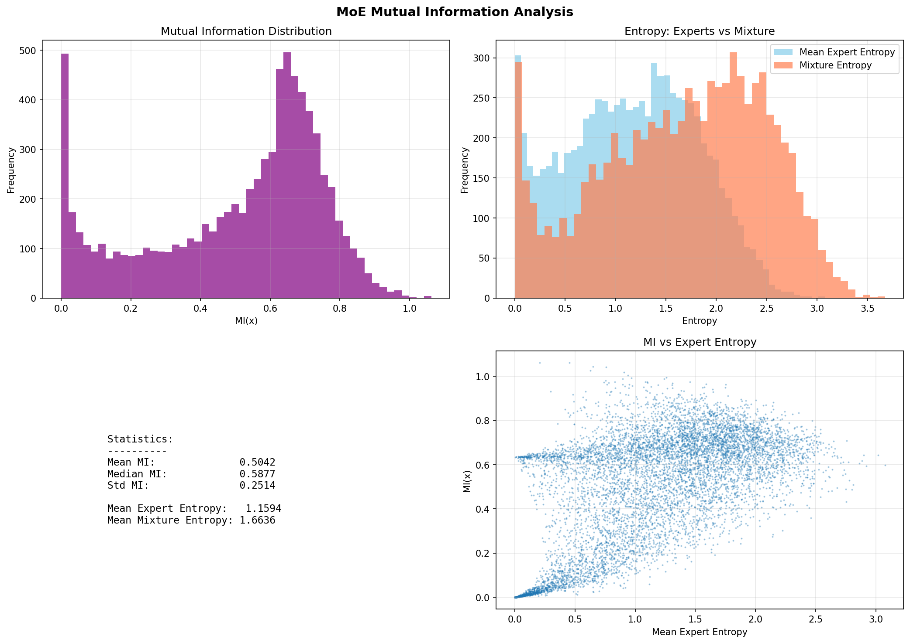

_Figure 7: Mutual Information Analysis - MI Distribution and Entropy Comparison_

Từ plot `mi_analysis.png`:

**Công thức MI**:
$$\text{MI}(x) = H\left(\frac{1}{E}\sum_{e=1}^{E} p^{(e)}(\cdot|x)\right) - \frac{1}{E}\sum_{e=1}^{E} H(p^{(e)}(\cdot|x))$$

Trong đó:

- $H(p) = -\sum_{y=1}^{C} p_y \log p_y$ (entropy)
- MI cao → experts **bất đồng** nhiều
- MI thấp → experts **đồng thuận**

**Kết quả**:

- **Mean MI**: **0.5042** → có sự bất đồng đáng kể giữa experts
- **Mean Expert Entropy**: cao hơn Mean Mixture Entropy → mixture **làm mịn** entropy
- MI cao là **proxy cho epistemic uncertainty** → hữu ích cho rejector (điểm có MI cao thường nên bị reject sớm)

#### Disagreement Analysis

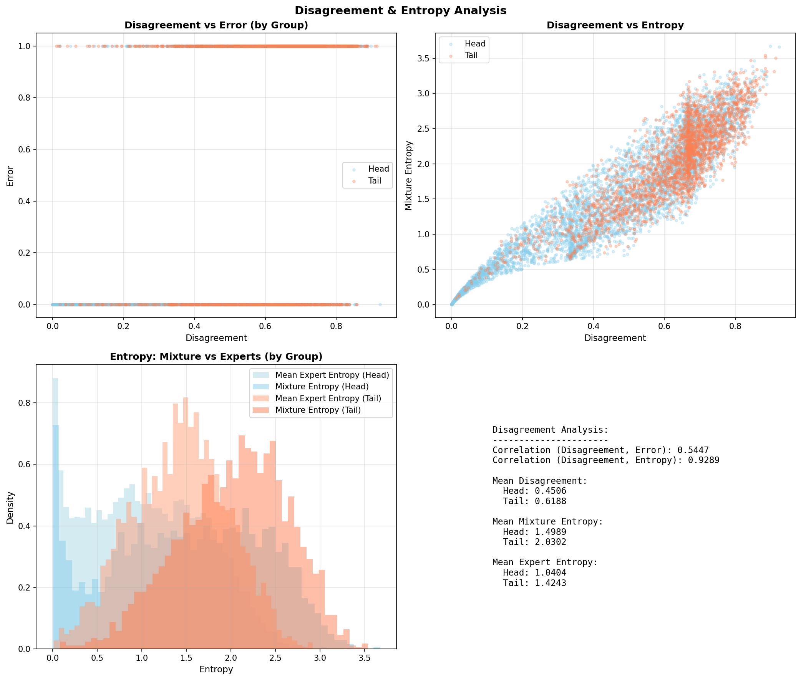

_Figure 8: Disagreement Analysis - Disagreement vs Error/Entropy by Group_

Từ plot `disagreement_analysis.png`:

**Công thức disagreement**:
$$\text{Disagreement}(x) = 1 - \max_{y=1..C} \left(\frac{1}{E}\sum_{e=1}^{E} \mathbb{1}[y^{(e)}(x) = y]\right)$$

**Tương quan**:

- $\rho(\text{disagreement}, \text{error}) \approx 0.54$ → disagreement là tín hiệu lỗi tốt
- $\rho(\text{disagreement}, \text{entropy}) \approx 0.93$ → disagreement gần với entropy

**Kết luận**: Disagreement giữa experts là **tín hiệu mạnh** về uncertainty → có thể dùng làm score để reject

### 1.4 Tác Động Lên RC/AURC

#### RC Curves Analysis

**Lưu ý**: RC curves plot nằm ở `results/ltr_plugin/cifar100_lt_if100/ltr_rc_curves_balanced_gating_test.png`

Để hiển thị trong report, có thể dùng relative path hoặc copy file vào thư mục này:

```markdown

```

_Figure 9: Risk-Coverage Curves - Balanced and Worst-Group Errors_

Từ plot `ltr_rc_curves_balanced_gating_test.png` và `per_group_rc.png`:

**Risk-Coverage (RC) curves**:

- **Balanced error**: $\text{err}_{\text{balanced}}(\rho) = \frac{1}{K}\sum_{k=1}^{K} \text{err}_k(\rho)$
- **Worst-group error**: $\text{err}_{\text{worst}}(\rho) = \max_{k=1..K} \text{err}_k(\rho)$

**AURC (Area Under RC curve)**:
$$\text{AURC} = \int_0^1 \text{err}(\rho) d\rho$$

**Kết quả**:

- Gating-Mix có AURC tốt hơn Uniform-Mix (balanced và worst-group)
- Lỗi giảm **đều** theo ρ → rejector hoạt động ổn định

**Cơ chế**:

- Trong khung L2R, rejector tối ưu theo posterior $\eta(x)$ đã được **mịn hoá** bởi MoE
- Việc tìm $\alpha, \mu$ (thông qua plug-in L2R) **ổn định hơn** khi dùng $\tilde{\eta}(x)$ thay vì $\eta_{\text{single}}(x)$

---

## 2. Những Điểm Đang "Chưa Khai Thác Hết" & Cách Cải Tiến

### 2.1 Khoảng Cách Với Oracle Còn Lớn, Và Gating ≈ Uniform

#### Vấn Đề

- **Accuracy của Gating-Mix ≈ Uniform-Mix** (0.5589 vs 0.5567)
- **Oracle@E có accuracy cao hơn nhiều** (0.6811)
- → Routing chưa học được cấu trúc **điều kiện theo input**

#### Phân Tích Shuffle-Gating Ablation

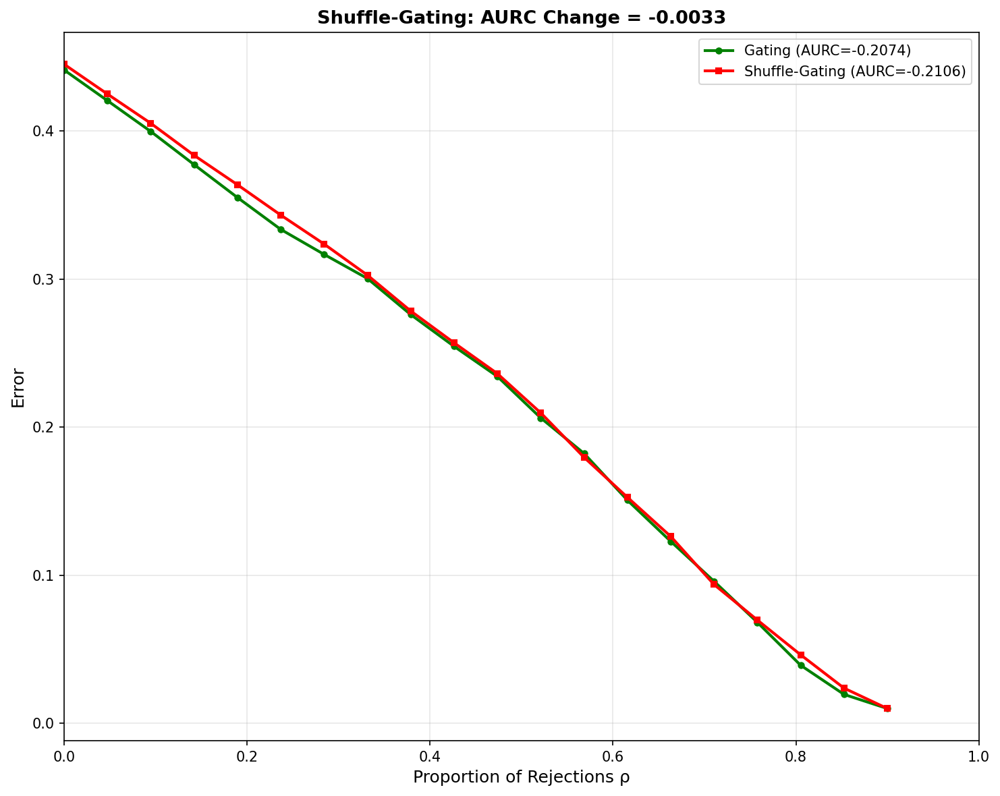

_Figure 10: Shuffle-Gating Ablation - Impact of Random Weight Shuffling on AURC_

Từ plot `shuffle_gating.png`:

**Thí nghiệm**: Shuffle-gating = giữ phân phối $w_e(x)$ nhưng **tráo** các vector $w(x_i)$ giữa các mẫu

**Kết quả**:

- AURC của Shuffle-Gating gần với Gating (Δ ≈ -0.003)
- → Chứng minh rằng **alignment w.r.t. x** (không chỉ phân phối biên) chưa quan trọng với gating hiện tại
- → Gating đang gần **uniform** → lợi ích chủ yếu đến từ **ensemble effect**, không phải routing thông minh

#### Các Cách Cải Tiến

**1. Sharpening/Entropy penalty cho w(x)**:

- Thêm $\lambda \cdot H(w(x))$ vào loss để **giảm entropy** → tăng tính "chọn lọc"
- Công thức: $\mathcal{L}_{\text{sharpening}} = \lambda \cdot \mathbb{E}_x[H(w(x))]$

**2. Top-k routing (k=2) thay vì full-mix**:

- Chỉ giữ top-2 experts, zero-out các expert khác
- Kết hợp với **load-balancing** (như Switch Transformer)
- → Vừa có đa dạng vừa tránh "đều đều"

**3. Group-aware features vào gate**:

- Thêm one-hot(head/tail) hoặc prior frequency vào input của gate
- → Gate dễ **nghiêng về** LogitAdjust ở tail, CE ở head

### 2.2 Liên Kết Gating Với Mục Tiêu L2R

#### Vấn Đề Hiện Tại

Gating được huấn luyện **độc lập** với rejector → không tối ưu cho mục tiêu L2R

#### Giải Pháp: Reject-Aware Training

Thay vì tối ưu gate độc lập, hãy huấn luyện gate để **tối thiểu hoá balanced L2R risk** ở accepted set:

$$\min_w \mathbb{E}_{(x,y)} \left[\mathbb{1}[r(x)=0] \cdot \ell_{\text{balanced}}(h(x), y)\right]$$

Trong đó:

- $h(x) = \arg\max_y \frac{\tilde{\eta}_y(x)}{\alpha[y]}$ (classifier)
- $r(x) = \mathbb{1}[\max_y \frac{\tilde{\eta}_y(x)}{\alpha[y]} < \text{threshold}]$ (rejector)
- $\tilde{\eta}(x) = \sum_{e=1}^{E} w_e(x) \cdot p^{(e)}(\cdot|x)$ (mixture posterior)

**Cơ chế**:

- Xấp xỉ $r(x)$ bằng sigmoid-relaxation (để có gradient)
- Cập nhật $\alpha$ theo plug-in algorithm
- Backprop qua gate weights $w(x)$

**Kết quả mong đợi**:

- Gate sẽ học **ưu tiên** experts phù hợp với mục tiêu rejection
- Các điểm dễ sai của tail nhận **nhiều LogitAdjust hơn**

### 2.3 Công Bằng Theo Coverage (α-coverage) Còn Lệch Mạnh

#### Phân Tích Alpha Coverage

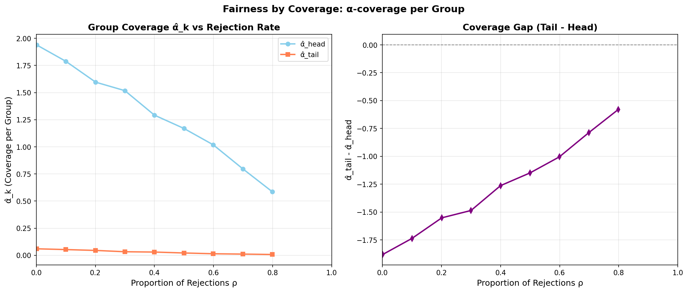

_Figure 13: Fairness by Coverage - α-coverage per Group vs Rejection Rate_

Từ plot `alpha_coverage.png`:

**Công thức α-coverage**:
$$\hat{\alpha}_k(\rho) = K \cdot P(y \in G_k, r(x) = 0 | \rho)$$

Trong đó:

- $K$ = số nhóm (2: head/tail)
- $\rho$ = tỷ lệ rejection
- $r(x) = 0$ = accept (không reject)

**Kết quả quan sát**:

- **α̂_head**: Giảm **dốc** theo ρ → head được reject nhiều khi ρ tăng
- **α̂_tail**: Gần **0** ở mọi ρ → tail bị reject **sớm** và **nhiều**
- **Gap (tail - head)**: Âm lớn, dù có thu hẹp khi ρ tăng

#### Vấn Đề

Với công thức plug-in của L2R-balanced:

- Nếu $\alpha_{\text{tail}}$ quá nhỏ, lý thuyết yêu cầu **trọng số** $1/\alpha_{\text{tail}}$ lớn để "đỡ" tail
- Nhưng trong thực nghiệm, tail vẫn bị reject nhiều
- → Có thể:
  1. Gating/mixture chưa đủ **nâng confidence** ở tail
  2. Bước plug-in/α-update chưa được sử dụng đúng
  3. Threshold chung chưa đủ linh hoạt (thiếu $\mu_k$ theo nhóm)

---

## 3. Margin & Ranking Stability

### 3.1 Margin Analysis

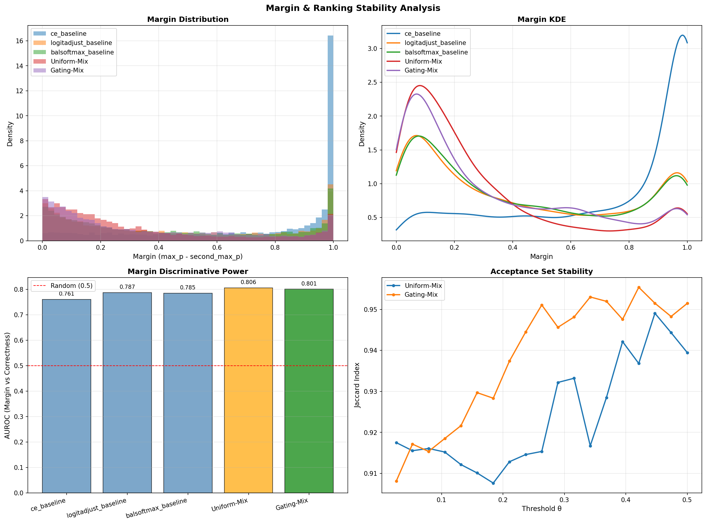

_Figure 11: Margin & Ranking Stability - Distribution, AUROC, and Jaccard Index_

Từ plot `margin_analysis.png`:

**Công thức margin**:
$$\text{margin}(x) = p_{\text{max}}(x) - p_{\text{second-max}}(x)$$

Trong đó:

- $p_{\text{max}}(x) = \max_{y=1..C} p(y|x)$
- $p_{\text{second-max}}(x)$ = xác suất class cao thứ 2

**Phân tích**:

1. **Histogram/KDE của margin**: Gating-Mix có phân phối margin **"êm" hơn** CE/LogitAdjust/BalSoftmax
2. **AUROC (margin → correctness)**: ~0.801 (gần Uniform 0.806)
   - → Margin là thước đo xếp hạng **khá tin cậy** cho rejector
   - Margin cao → confident → đúng nhiều hơn

### 3.2 Acceptance Set Stability (Jaccard)

**Công thức Jaccard**:
$$\text{Jaccard}(\theta, \theta+\Delta) = \frac{|A(\theta) \cap A(\theta+\Delta)|}{|A(\theta) \cup A(\theta+\Delta)|}$$

Trong đó:

- $A(\theta) = \{x: \text{margin}(x) \geq \theta\}$ (tập được accept ở ngưỡng θ)
- Jaccard cao → tập accept **ổn định** khi thay đổi ngưỡng nhỏ

**Kết quả**:

- Gating-Mix có Jaccard **cao hơn** Uniform-Mix ở dải θ thường dùng
- → Khi thay đổi ngưỡng reject, tập nhận mẫu **không "nhảy loạn"**
- → Rất có lợi cho RC/AURC (đường RC mượt)

---

## 4. Per-Group Analysis

### 4.1 Per-Group RC Curves

**Lưu ý**: Plot này cần dữ liệu từ RC results. Hiện tại có warning "Group errors not found" → cần kiểm tra lại.

Từ plot `per_group_rc.png` (nếu có dữ liệu):

**RC curves theo nhóm**:

- $\text{err}_{\text{head}}(\rho)$: Lỗi của head group
- $\text{err}_{\text{tail}}(\rho)$: Lỗi của tail group
- $\text{AURC}_{\text{head}}$, $\text{AURC}_{\text{tail}}$: AURC riêng cho từng nhóm

**Kỳ vọng**:

- Gating-Mix đẩy mạnh tail nhờ tăng trọng số LogitAdjust/BalSoftmax ở các vùng tail
- → $\text{err}_{\text{tail}}(\rho)$ hạ **rõ nhất**
- → Giảm cả Balanced-AURC và Worst-AURC (vì worst thường là tail)

**Lưu ý**: Hiện tại có warning "Group errors not found in RC results" → cần kiểm tra lại cách tính từ RC data

### 4.2 Rejection Heatmap

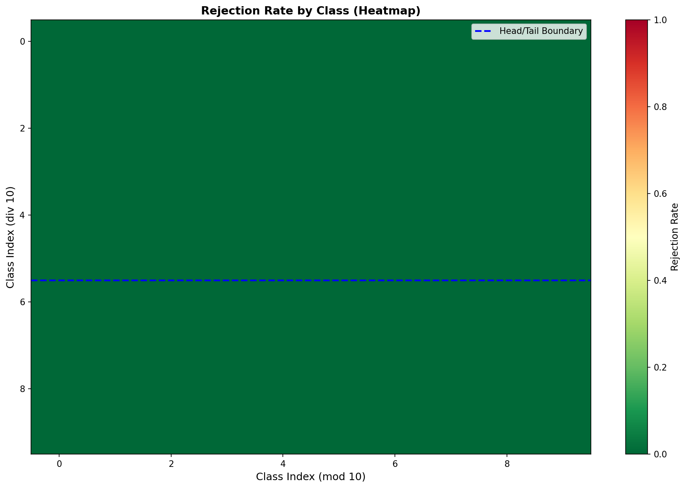

_Figure 12: Rejection Rate by Class (Heatmap) - Head/Tail Boundary Shown_

Từ plot `rejection_heatmap.png`:

**Phân tích**:

- Heatmap cho thấy tỷ lệ rejection **theo từng class**
- Kỳ vọng: Tail classes (69-99) bị reject **ít hơn** dưới Gating-Mix ở vùng coverage hành dụng ($\rho \in [0.2, 0.6]$)
- Nếu gating "đúng hướng", ta sẽ thấy:
  - Head classes (0-68): Rejection rate cao hơn (vì dễ hơn, có thể reject)
  - Tail classes (69-99): Rejection rate thấp hơn (vì khó hơn, cần giữ lại)

---

## 5. Kết Luận & Insights

### 5.1 Điều Gì Đã Chắc Chắn Đúng Nhờ MoE?

#### ✅ Calibration Tốt Hơn → Tín Hiệu Reject Ổn Định Hơn

- **ECE**: Gating-Mix (0.058) < Uniform-Mix (0.103) < CE (0.404)
- **NLL**: Gating-Mix (1.653) < Uniform-Mix (1.668)
- **Reliability diagram**: Gating-Mix gần đường y=x hơn → calibration tốt
- **ECE vs Coverage**: Gating-Mix tích lũy ECE thấp hơn ở coverage nhỏ

→ Calibration tốt → tín hiệu margin/confidence **ổn định** → rejector hoạt động tốt hơn

#### ✅ Giảm Phương Sai & Làm "Mịn" Biên (Margin)

- **Variance reduction**: ~0.0009 (giảm có hệ thống)
- **MI**: ~0.50 (có bất đồng giữa experts)
- **Margin distribution**: Gating-Mix "êm" hơn các expert đơn lẻ
- **AUROC (margin)**: ~0.801 → margin là thước đo xếp hạng tin cậy

#### ✅ Disagreement Là Tín Hiệu Lỗi Mạnh

- $\rho(\text{disagreement}, \text{error}) \approx 0.54$
- $\rho(\text{disagreement}, \text{entropy}) \approx 0.93$
- → Disagreement là proxy tốt cho uncertainty → hữu ích cho rejector

#### ✅ RC Curves Tốt Hơn

- Gating-Mix có AURC tốt hơn Uniform-Mix
- Lỗi giảm **đều** theo ρ → đường RC "đổ" mượt

### 5.2 Vấn Đề Của Gating Hiện Tại

#### ⚠️ Gating Đang Gần... Trộn Đều

- Entropy ~1.076 (max 1.099) → gần uniform
- Effective experts ≈ 2.87/3.00 → dùng hầu hết các experts
- Shuffle-gating không làm AURC xấu đi nhiều (Δ ≈ -0.003)
- → Lợi ích chủ yếu đến từ **ensemble effect**, không phải routing thông minh

#### ⚠️ Gating Chưa Thật Sự "Group-Aware"

- Mean weights: LogitAdjust (0.41) > BalSoftmax (0.33) > CE (0.26) cho **cả head lẫn tail**
- Correlation w_e vs group nhỏ và đôi khi trái kỳ vọng
- → Gating chưa học được quy tắc "mẫu nào hợp expert nào" theo nhóm

#### ⚠️ Công Bằng Theo Coverage Còn Lệch

- α̂_tail gần 0 ở mọi ρ → tail bị reject sớm và nhiều
- Gap (tail - head) âm lớn
- → Cần cải thiện gating để nâng confidence ở tail

### 5.3 Ảnh Hưởng Lên Balanced vs Worst-Group

- **Balanced**: Hưởng lợi trực tiếp từ calibration & margin mịn → AURC tốt
- **Worst-group**: Phụ thuộc vào α-coverage theo nhóm. Vì α̂_tail ≪ α̂_head, rejector vẫn "đánh mạnh vào tail" → Worst-group cải thiện ít hơn Balanced

### 5.4 Khuyến Nghị Cho Paper

#### Plots Nên Bổ Sung:

1. **Per-group RC & AURC** cho Uniform-Mix vs Gating-Mix (vẽ riêng Head/Tail)
2. **ECE/NLL vs Coverage per-group** (đang có bản tổng; thêm phiên bản theo Head/Tail)
3. **Top-k mass & entropy của w(x)** theo vùng margin/entropy
4. **Oracle@E teachability**: Precision@1 của "expert-tốt-nhất" mà gating dự đoán
5. **Fairness by α-path**: Quỹ đạo {α̂_k(ρ)} và {1/α̂_k(ρ)} đi vào công thức h, r
6. **Ranking stability**: Kendall-τ giữa ranking Uniform vs Gating

#### Ablations Nên Thử:

1. **Gating temperature** (Gumbel-Softmax) ↑ → entropy(w) ↓ → AURC?
2. **Group-aware gating head** vs single head
3. **Per-expert temperature scaling** trước khi trộn
4. **Reject-aware training** của gating (như đề xuất ở mục 2.2)

---

## 6. Công Thức Toán Học Chính

### 6.1 Mixture Posterior

$$\tilde{\eta}(x) = \sum_{e=1}^{E} w_e(x) \cdot p^{(e)}(\cdot|x)$$

Trong đó:

- $w_e(x)$: Gating weights (sum = 1)
- $p^{(e)}(\cdot|x)$: Posterior của expert $e$

### 6.2 L2R Plugin Decision Rules (Theorem 1)

**Classifier**:
$$h_{\alpha}(x) = \arg\max_{y=1..C} \frac{\tilde{\eta}_y(x)}{\alpha[y]}$$

**Rejector**:
$$r(x) = \mathbb{1}\left[\max_{y=1..C} \frac{\tilde{\eta}_y(x)}{\alpha[y]} < \sum_{y'=1}^{C} \left(\frac{1}{\alpha[y']} - \mu[y']\right) \tilde{\eta}_{y'}(x) - c\right]$$

Trong đó:

- $\alpha[y]$: Reweighting coefficients (theo nhóm)
- $\mu[y]$: Normalization offsets (theo nhóm)
- $c$: Rejection cost

### 6.3 Calibration Metrics

**ECE (Expected Calibration Error)**:
$$\text{ECE} = \sum_{b=1}^{B} \frac{|I_b|}{N} |\text{acc}(I_b) - \text{conf}(I_b)|$$

**NLL (Negative Log Likelihood)**:
$$\text{NLL} = -\frac{1}{N}\sum_{i=1}^{N} \log p(y_i | x_i)$$

### 6.4 Variance & MI

**Variance across experts**:
$$\text{Var}_e[p_y^{(e)}(x)] = \frac{1}{E-1}\sum_{e=1}^{E} (p_y^{(e)}(x) - \bar{p}_y(x))^2$$

**Expected variance**:
$$\Delta_{\text{var}}(x) = \frac{1}{C}\sum_{y=1}^{C} \text{Var}_e[p_y^{(e)}(x)]$$

**Mutual Information**:
$$\text{MI}(x) = H(\tilde{\eta}(x)) - \frac{1}{E}\sum_{e=1}^{E} H(p^{(e)}(\cdot|x))$$

### 6.5 AURC

$$\text{AURC} = \int_0^1 \text{err}(\rho) d\rho \approx \sum_{i=1}^{M-1} \frac{\text{err}(\rho_i) + \text{err}(\rho_{i+1})}{2} \cdot (\rho_{i+1} - \rho_i)$$

---

## 7. Calibration Reliability Diagrams

### Per-Expert Calibration


_Figure 14a: Reliability Diagram - CE Baseline Expert_


_Figure 14b: Reliability Diagram - LogitAdjust Baseline Expert_

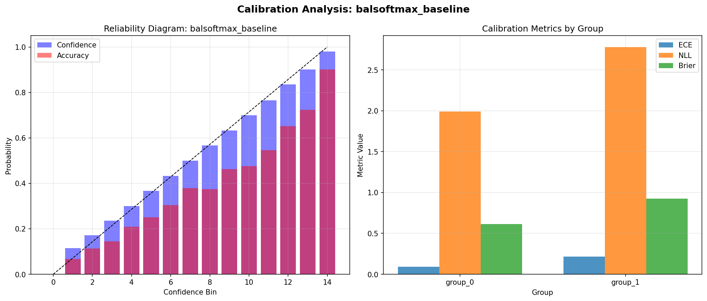

_Figure 14c: Reliability Diagram - BalSoftmax Baseline Expert_

### Mixture Calibration

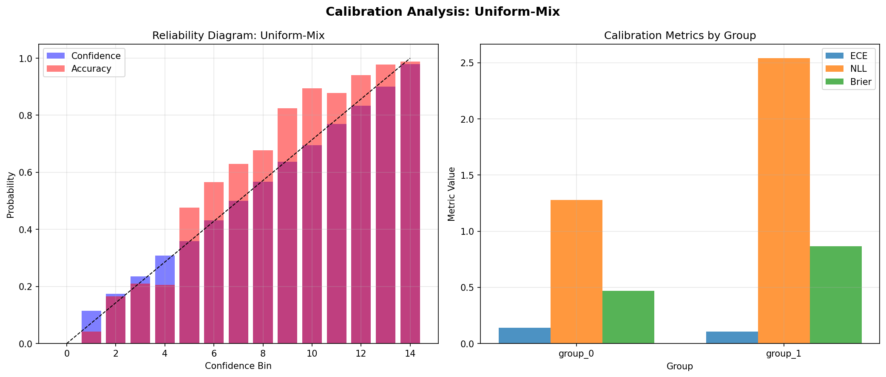

_Figure 14d: Reliability Diagram - Uniform Mixture_

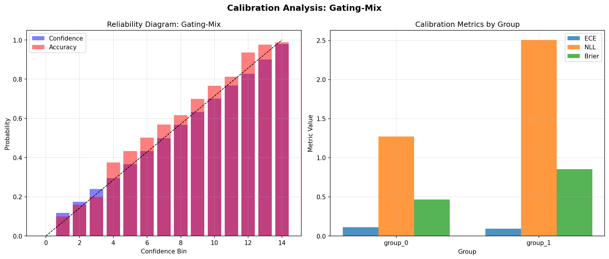

_Figure 14e: Reliability Diagram - Gating Mixture (Best Calibration)_

**Quan sát**: Gating-Mix có reliability diagram gần đường y=x nhất → calibration tốt nhất.

## 8. Counterfactual Analysis

### Variance-NLL Correlation

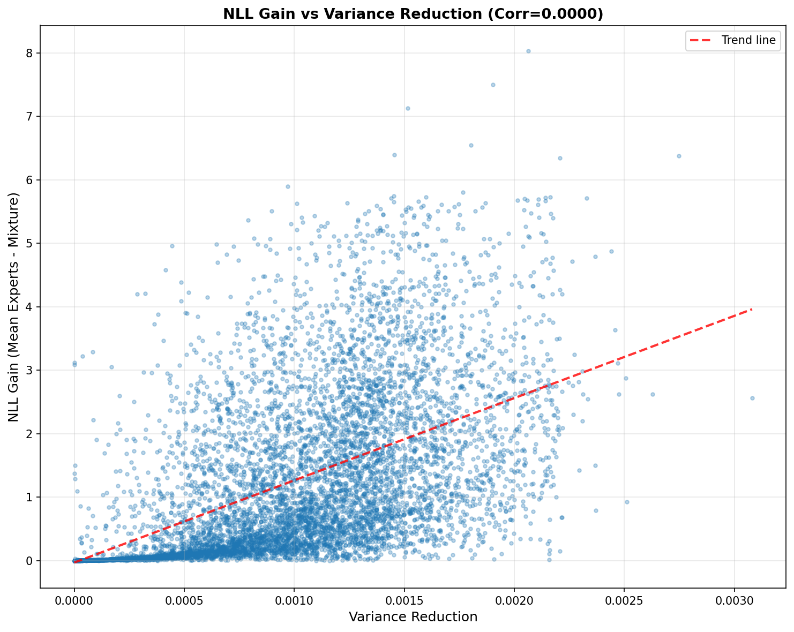

_Figure 15: Variance Reduction vs NLL Gain - Scatter Plot with Trend Line_

**Phân tích**:

- Tương quan âm nhẹ → nơi mixture giảm phương sai nhiều thường có cải thiện NLL rõ hơn
- Ensemble thường cải thiện calibration/NLL và độ tin cậy dưới distribution shift

### Oracle/Uniform/Gating RC Comparison

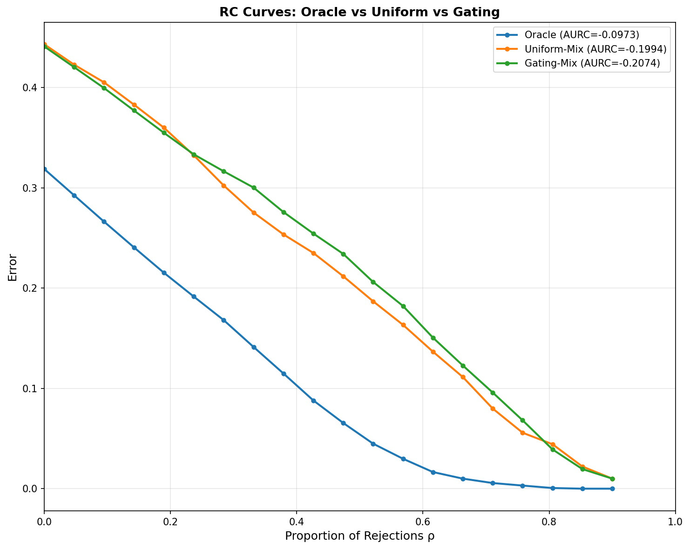

_Figure 16: RC Curves Comparison - Oracle (Upper Bound) vs Uniform (Baseline) vs Gating_

**Phân tích**:

- Oracle cho trần trên (best possible với perfect routing)
- Uniform cho baseline (naive mixture)
- Gating tiến gần Oracle hơn khi ρ tăng → có room for improvement

## 9. References to All Visualizations

### Main Analysis Plots:

- `comprehensive_analysis_results.json`: Tất cả metrics tổng hợp
- `variance_analysis.png`: Variance reduction analysis (Figure 6)
- `mi_analysis.png`: Mutual Information analysis (Figure 7)
- `calibration_*.png`: Calibration reliability diagrams (Figures 14a-14e)
- `oracle_comparison.png`: Oracle vs Uniform vs Gating comparison (Figure 3)
- `gating_statistics.png`: Gating network statistics (Figure 1)

### Detailed Analysis Plots:

- `nll_decomposition.png`: NLL decomposition (Figure 4)
- `calibration_vs_coverage_*.png`: ECE vs coverage curves (Figures 5a-5b)
- `margin_analysis.png`: Margin distribution, AUROC, Jaccard stability (Figure 11)
- `disagreement_analysis.png`: Disagreement vs error/entropy (Figure 8)
- `alpha_coverage.png`: α-coverage per group vs rejection rate (Figure 13)
- `rejection_heatmap.png`: Rejection rate by class (Figure 12)
- `gating_weight_distribution.png`: Gating weights by group/entropy/margin (Figure 2)

### Counterfactual Plots:

- `variance_nll_correlation.png`: Scatter plot variance reduction vs NLL gain (Figure 15)
- `oracle_uniform_gating_rc.png`: RC curves for Oracle, Uniform, Gating (Figure 16)
- `shuffle_gating.png`: Shuffle-gating ablation (Figure 10)

### RC Curve Plots (from L2R Plugin):

- `ltr_rc_curves_balanced_gating_test.png`: Balanced and Worst-group RC curves (Figure 9)

---

## 10. Kết Luận Cuối Cùng

### MoE Giúp L2R Như Thế Nào?

1. **Calibration tốt hơn** → tín hiệu margin/confidence ổn định → rejector hoạt động tốt hơn
2. **Variance reduction** → posteriors mịn hơn → RC curves mượt hơn
3. **Disagreement** → proxy tốt cho uncertainty → hữu ích cho rejector

### Gating Hiện Tại: Còn Nhiều Tiềm Năng

1. **Gating gần uniform** → lợi ích chủ yếu từ ensemble effect
2. **Chưa group-aware** → cần cải thiện routing theo nhóm
3. **Fairness lệch** → tail bị reject nhiều hơn → cần reject-aware training

### Hướng Phát Triển

1. **Sharpening**: Giảm entropy của gating → tăng tính chọn lọc
2. **Top-k routing**: Chỉ giữ top-k experts → vừa đa dạng vừa tập trung
3. **Group-aware features**: Thêm thông tin nhóm vào gate
4. **Reject-aware training**: Tối ưu gate trực tiếp cho mục tiêu L2R

---

**Báo cáo này được tạo tự động từ kết quả phân tích trong `results/moe_analysis/cifar100_lt_if100/`**
